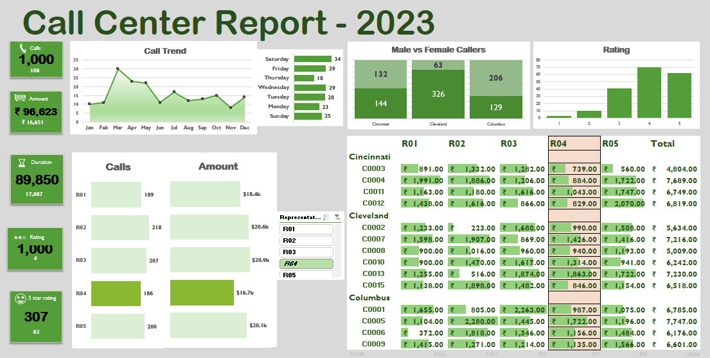
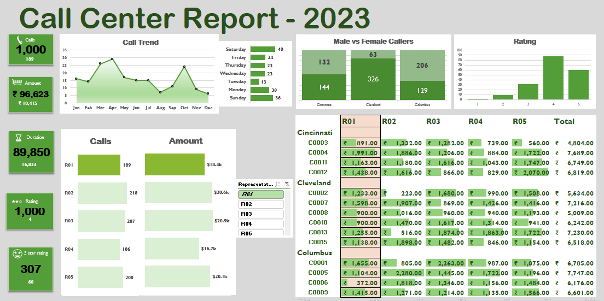

# 📞 Call Center Report - 2023

This project presents an interactive Call Center Report Dashboard for the year 2023, built using **Microsoft Excel**. It was created by following a guided tutorial by **Chandoo**(Youtuber) . The dashboard highlights key call center metrics and provides visual insights using slicers, data models, and conditional formatting.

## 📊 Dashboard Overview

The dashboard features:

- 💰 **Amount Summary** – Revenue generated by different representatives.
- ⏱ **Call Duration** – Total call duration and breakdown.
- ⭐ **Customer Rating Distribution** – Including 5-star ratings.
- 🚻 **Male vs Female Callers** – Segregated by city.
- 🗓 **Day-wise Call Distribution** – Number of calls per day of the week.
- 📋 **Representative-wise Call & Amount Comparison**
- 🔍 **Interactive Slicers** to filter data by representative.

## 🧰 Tools & Features Used

- **Microsoft Excel**
  - Data Model with multiple related tables
  - Pivot Tables & Pivot Charts
  - Conditional Formatting
  - Slicers for dynamic filtering
  - Formulas & calculated fields
- **Tutorial Reference**: [Chandoo](https://youtu.be/7QNgqq154gE?feature=shared)

## 🖼️ Dashboard Snapshots

### Dashboard View 1

### Dashboard View 2

## 📚 Learnings

- Built a real-time dynamic dashboard using Excel's advanced features.
- Gained experience working with **data models**, **pivot charts**, and **interactive controls**.
- Learned how to visualize operational KPIs effectively.

---

## 📬 Contact

If you'd like to connect or collaborate, feel free to reach out via GitHub or LinkedIn!

